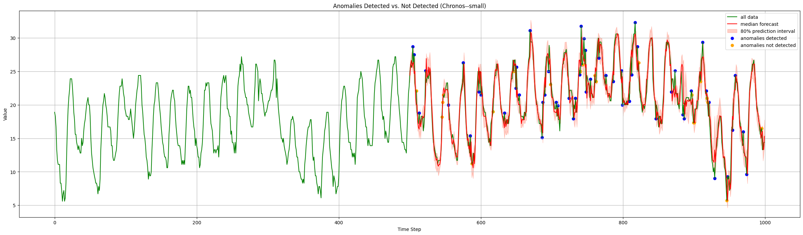
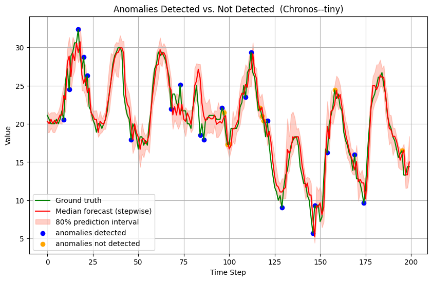
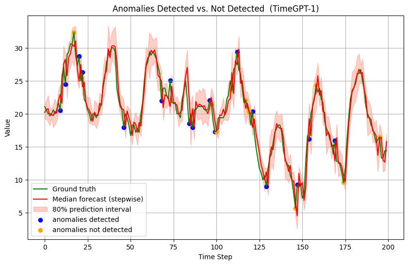

# Probabilistic Forecasting for Anomaly Detection using TSFMs

A project exploring the use of Time Series Foundation Models (TSFMs) like Chronos and TimeGPT for anomaly detection via prediction intervals.

Chronos:

Other Models:

 

 

Blue = Detected, Orange = Missed
